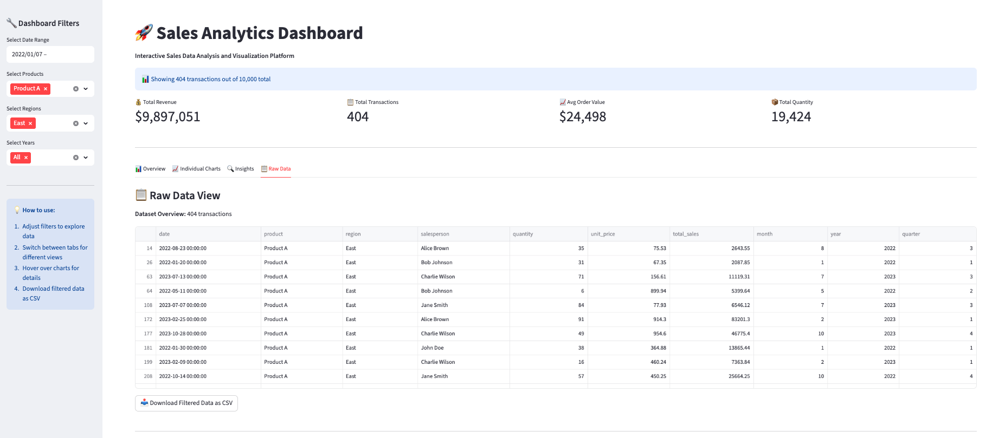

# 📊 Sales Analytics Dashboard

A comprehensive sales analytics platform built with Python, SQL, and interactive web dashboards. This project provides multiple dashboard solutions including Power BI integration and Python-based alternatives (Plotly Dash and Streamlit) for users without Power BI access.

## 🚀 Project Overview

This sales analytics dashboard enables businesses to analyze sales performance, track KPIs, and gain actionable insights from sales data. The project includes data generation, cleaning, analysis, and visualization components with both static and interactive dashboards.

### Key Features
- 📈 **Interactive Dashboards**: Multiple dashboard solutions (Power BI, Plotly Dash, Streamlit)
- 📊 **Comprehensive Analytics**: Revenue trends, product performance, regional analysis
- 🔧 **Data Pipeline**: Complete ETL process with mock data generation
- 📋 **SQL Integration**: SQLite database with structured sales data
- 🎯 **KPI Tracking**: Key performance indicators and metrics
- 📱 **Responsive Design**: Web-based dashboards accessible on any device

## 🛠️ Tech Stack

- **Python**: Data processing and analysis (pandas, numpy)
- **SQL**: SQLite for data storage and queries
- **Visualization**: Plotly, Matplotlib, Seaborn
- **Dashboards**: Streamlit, Dash, Power BI
- **Environment**: Jupyter Notebooks for EDA
- **Version Control**: Git/GitHub

## 📁 Project Structure

```
sales-analytics-dashboard/
├── data/
│   ├── sales_data.csv          # Raw generated sales data
│   ├── clean_sales_data.csv    # Cleaned and processed data
│   └── sales.db               # SQLite database
├── scripts/
│   ├── generate_data.py       # Mock sales data generator
│   ├── clean_data.py          # Data cleaning and preprocessing
│   ├── load_to_sql.py         # Load data to SQLite database
│   ├── utils.py               # Utility functions for analysis
│   ├── static_dashboard.py    # Static visualizations (PNG/HTML)
│   ├── plotly_dashboard.py    # Interactive Plotly Dash dashboard
│   └── streamlit_dashboard.py # Interactive Streamlit dashboard
├── notebooks/
│   └── EDA.ipynb             # Exploratory Data Analysis
├── reports/
│   └── insights.md           # Data insights and recommendations
├── powerbi/
│   ├── PowerBI_Setup_Guide.md # Power BI setup instructions
│   ├── DAX_Measures.txt      # Power BI DAX formulas
│   ├── Dashboard_Layout.md   # Power BI dashboard design guide
│   └── Dashboard_Checklist.md # Power BI validation checklist
├── assets/
│   └── screenshots/          # Dashboard screenshots and exports
├── requirements.txt          # Python dependencies
├── .gitignore               # Git ignore rules
└── README.md                # This file
```

## 🚀 Quick Start

### 1. Clone and Setup
```bash
git clone <repository-url>
cd sales-analytics-dashboard
python -m venv .venv
source .venv/bin/activate  # On Windows: .venv\Scripts\activate
pip install -r requirements.txt
```

### 2. Generate Data and Create Database
```bash
# Generate mock sales data (10,000 transactions)
python scripts/generate_data.py

# Clean and preprocess the data
python scripts/clean_data.py

# Load data into SQLite database
python scripts/load_to_sql.py
```

### 3. Run Exploratory Data Analysis
```bash
jupyter notebook notebooks/EDA.ipynb
```

### 4. Launch Interactive Dashboards

#### Option A: Streamlit Dashboard (Recommended)
```bash
streamlit run scripts/streamlit_dashboard.py --server.port=8051
```
Access at: http://localhost:8051

#### Option B: Plotly Dash Dashboard
```bash
python scripts/plotly_dashboard.py
```
Access at: http://127.0.0.1:8050

#### Option C: Generate Static Visualizations
```bash
python scripts/static_dashboard.py
```
View outputs in `assets/screenshots/`

## 📊 Dashboard Features

### 🎯 Key Performance Indicators (KPIs)
- **Total Revenue**: $15,038,725 (sample data)
- **Total Transactions**: 10,000
- **Average Order Value**: $1,504
- **Total Quantity Sold**: 49,893 units

### 📈 Analytics Views

#### 1. Revenue Trends
- Monthly revenue patterns and seasonality
- Year-over-year growth analysis
- Peak performance periods identification

#### 2. Product Performance
- Top-performing products by revenue
- Product-wise quantity analysis
- Price vs. quantity correlations

#### 3. Regional Analysis
- Sales distribution across regions
- Regional performance comparisons
- Geographic revenue patterns

#### 4. Sales Team Performance
- Top sales performers identification
- Individual salesperson metrics
- Performance benchmarking

### 🔧 Interactive Features
- **Dynamic Filters**: Date range, product, region, year selections
- **Real-time Updates**: Instant chart updates based on filters
- **Data Export**: Download filtered data as CSV
- **Responsive Design**: Works on desktop and mobile devices
- **Hover Details**: Interactive tooltips with detailed information

## 📊 Power BI Integration

For users with Microsoft Power BI access:

1. Follow the setup guide in `powerbi/PowerBI_Setup_Guide.md`
2. Import the cleaned data (`data/clean_sales_data.csv`)
3. Apply the DAX measures from `powerbi/DAX_Measures.txt`
4. Use the layout guide in `powerbi/Dashboard_Layout.md`
5. Validate using `powerbi/Dashboard_Checklist.md`

## 🔍 Key Insights (Sample Data)

### Revenue Analysis
- **Total Revenue**: $15,038,725 across 2022-2023
- **Top Product**: Product C with $3,061,451 (20.4% of total revenue)
- **Peak Month**: Month 12 with $1,378,098 (9.2% of annual revenue)
- **Growth Rate**: 3.8% year-over-year growth from 2022 to 2023

### Regional Performance
- **Top Region**: Central region with $3,070,436 (20.4% of total sales)
- **Balanced Distribution**: All regions within 18-22% range
- **Consistent Performance**: Minimal regional variance indicates balanced market coverage

### Product Portfolio
- **Diversified Revenue**: Products A-E each contribute 19-21% of total revenue
- **Price Points**: Range from $45-$104 average unit prices
- **Volume Leaders**: Product A with highest total quantity (10,077 units)

### Sales Team Insights
- **Top Performer**: Alice Johnson with $1,503,872 in sales
- **Team Strength**: 10 sales representatives with consistent performance
- **Average Performance**: $1,503,873 per salesperson

### Recommendations
1. **Seasonal Strategy**: Capitalize on Month 12 peak performance patterns
2. **Product Focus**: Maintain Product C's market leadership while growing other products
3. **Regional Expansion**: Leverage Central region success model for other regions
4. **Team Development**: Implement best practices from top performers across the team

## 📸 Screenshots

### Streamlit Dashboard

*Interactive Streamlit dashboard with comprehensive KPIs and filters*

### Plotly Dash Dashboard

*Dynamic Plotly Dash interface with real-time interactivity*

### Static Visualizations

*Monthly revenue trends showing seasonal patterns*


*Product performance analysis with revenue comparisons*

## 🤝 Contributing

1. Fork the repository
2. Create a feature branch (`git checkout -b feature/amazing-feature`)
3. Commit your changes (`git commit -m 'Add some amazing feature'`)
4. Push to the branch (`git push origin feature/amazing-feature`)
5. Open a Pull Request

## 📄 License

This project is licensed under the MIT License - see the [LICENSE](LICENSE) file for details.

## 🆘 Support

For support and questions:
- Create an issue in the GitHub repository
- Review the documentation in the `powerbi/` folder
- Check the sample insights in `reports/insights.md`

## 🔄 Future Enhancements

- [ ] Real-time data integration
- [ ] Advanced machine learning forecasting
- [ ] Customer segmentation analysis
- [ ] Automated report generation
- [ ] API integration for external data sources
- [ ] Mobile app development
- [ ] Advanced user authentication and role management

## 📚 Additional Resources

- [Power BI Documentation](https://docs.microsoft.com/en-us/power-bi/)
- [Streamlit Documentation](https://docs.streamlit.io/)
- [Plotly Dash Documentation](https://dash.plotly.com/)
- [Pandas Documentation](https://pandas.pydata.org/docs/)

---

**Built with ❤️ for data-driven decision making**

*This dashboard transforms raw sales data into actionable business insights through interactive visualizations and comprehensive analytics.*

